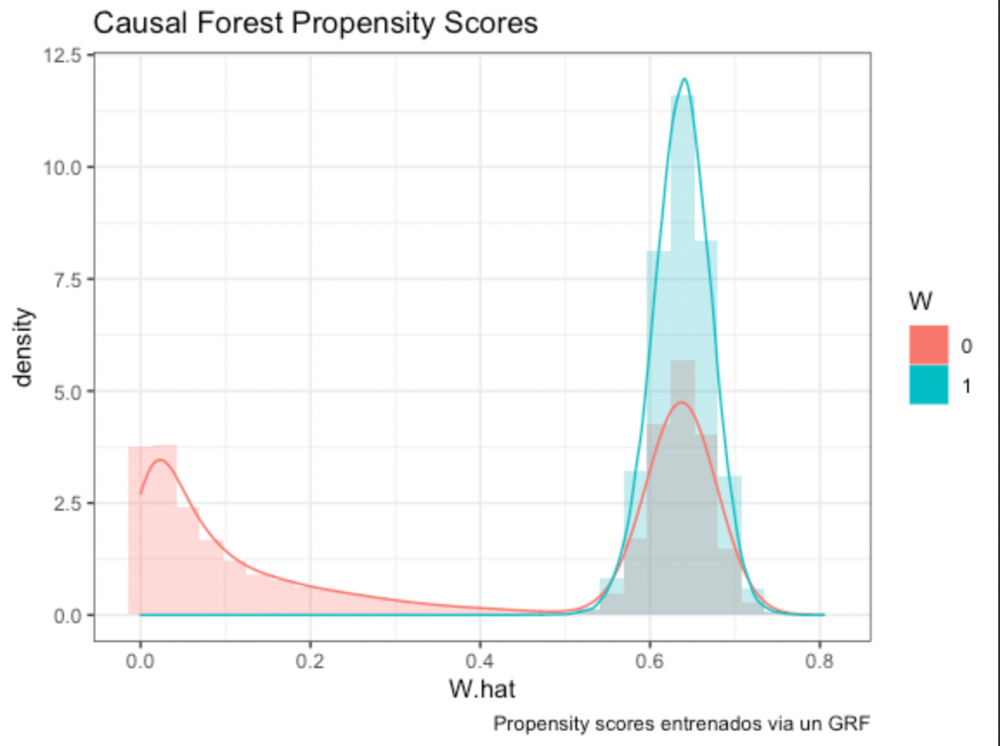

#### Alfredo Lefranc Flores
#### Cynthia Raquel Valdivia Tirado
#### Rafael Sandoval Fernández
#### Marco Antonio Ramos Juárez
#### Francisco Velazquez Guadarrama


```{r setup, include=FALSE}
knitr::opts_chunk$set(echo = TRUE, comment = NA, message = FALSE,
                      warning = FALSE,
                      fig.width = 6, fig.height = 4.5, fig.align = "right")
```

# Overview

Los contratan como data scientists para una empresa que vende electrodomesticos. La empresa lanzó un experimento de control aleatorio via un mail en donde se envió un catalogo de los productos al grupo de tratamiento `mailing_indicator`. 

Tu objetivo es estimar el impacto del envío sobre el gasto incremental: 

$$\tau_{i}=\mathbb{E}[Y_{i}(1)-Y_{i}(0)|\boldsymbol{x}_{i}],$$

En particular, queremos estimar el impacto de enviar el catalogo a nivel de cliente. Para ello, pondremos a competir algunos de los modelo de Causal Machine Learning que hemos aprendido en clase: 

- Double Debiased Machine Learning 

- Causal Forests 

Adicionalmente, desarrollen una estrategia de focalización con base en los resultados de tu modelo. Elabora sobre la lógica económica (i.e. identifica los Beneficios y Costos Marginales de enviar la campaña). Finalmente, corrobora la validez externa de la estrategia usando datos de un año. Esto nos dará un termómetro de la utilidad del modelo para campañas posteriores. 

Tip!: En los chunks donde vaya a haber modelos o cálculos complicados, usen `cache=T`

### Paso 1: Estimación y predicción the Conditional Average Treatment Effects (CATE)

Carguemos los datos de 2015

```{r}
#_________________
#Ambiente
#__________________

# librerias
library(tidyverse)
library(data.table)
library(gamlr)
library(grf)
library(xgboost)
library(ranger)
library(RCT)
library(lfe)
library(stargazer)
library(kableExtra)
library(knitr)
library(devtools)
library(parallel)
library(broom)
library(gridExtra)
library(causalTree)
library(gtools)
library(reshape2)
library(DT)
library(sjPlot)
library(smotefamily)


# desactiva notación científica       
options(scipen = 999)

# datos
load("Customer-Development-2015-1.RData")

```


Dividimos la base en entrenamiento y validacion. Usamos un seed fijo para replicabilidad:


# Data cleaning

### 1. Haz una primera revisión de la base. Cuantas variables tienen `NA`

```{r, echo=FALSE}
# nos devuelve las columnas que tengan NAs
(apply(crm, 2, function(x) sum(is.na(x))) > 0) %>% which()

#creo base de exploración
inspection<-tidy(crm)
datatable(inspection, options = list(pageLength = 5))

```
En una revisión inicial de la base, notamos que ninguna variable tiene `NA`s y todas las variables son numéricas.

### 2. Muestra la matriz de correlación entre variables. Muestra los pares de variables que tienen más de 95% de correlación. Remueve una de cada par multicolineal. 


#### Preprocesamiento

Primero voy estandarizar los datos para reducir el tiempo de computo:
```{r}
#identifico dummies
dummies_id<-inspection %>% filter(min ==0 & max ==1  & range ==1 )

#creo una base de datos sin dummies para estandarizar
z_numerics<- crm %>% select(-dummies_id$column,-customer_id)
dummies<- crm %>% select(dummies_id$column)

#transformo la base de datos estandarizada para reducir el tiempo de calculo
z_numerics<-scale(z_numerics)
cor_data<-cbind(z_numerics,dummies)
```

#### Correlograma
```{r}
# mariz de correlacion
cor_mat <- cor(cor_data)

reorder_cormat <- function(cormat){
  # Use correlation between variables as distance
  dd <- as.dist((1-cormat)/2)
  hc <- hclust(dd)
  cormat <-cormat[hc$order, hc$order]
}
cor_mat <- reorder_cormat(cor_mat)
```

Nos quedamos con el triángulo superior de la matriz de correlación. Así tenemos cada combinación entre variables una sola vez y tampoco tenemos la combinación de cada variable consigo misma (diagonal).

Luego transformamos la matriz para hacer un `ggheatmap`. Para esta gráfica nos basamos en la página de Statistical tools for high-throughput data analysis (STHDA).

```{r}
cor_mat[lower.tri(cor_mat, diag = TRUE)] <- NA

cor_mat %>% melt(na.rm = TRUE) %>%
  ggplot(aes(Var2, Var1, fill = value))+
 geom_tile(color = "white")+
 scale_fill_gradient2(low = "blue", high = "red", mid = "white", 
   midpoint = 0, limit = c(-1,1), space = "Lab", 
    name="Pearson\nCorrelation") +
  labs(x="", y="",
       title="Matriz de correlación")+
  theme_minimal()+
 theme(axis.text.x = element_blank(),
       axis.text.y = element_blank())+
 coord_fixed()
```


#### Identificación de las correlaciones más grandes

Definimos una dummy que indica si la columna x tiene alguna correlación mayor a 0.95 en valor absoluto con alguno de los renglones. Aplico la dummy a toda la matriz y extraigo los nombres de las columnas que cumplan con esto.

```{r, echo=FALSE}
# dummy 
cor_mat[,68] %>% abs() %>% max(na.rm = TRUE) > 0.95

highcor <- cor_mat[,(apply(cor_mat, 2, 
                          function(y) (abs(y) %>% 
                                         max(na.rm = TRUE) > 0.95)))] %>%
  colnames()
```

Las variables con correlación mayor a 0.95 con algún par son `r highcor`. Las filtramos de la base.

```{r}
crm <- crm %>% select(-highcor)
```


### 3 (2 pts). Corrobora que la asignación tratamiento fue aleatoria mediante revisión del balance. Realiza las pruebas balance T y F. Cuántas variables salen desbalanceadas? Que muestra esto sobre la asignación de tratamiento?

Primero revisamos las proporciones de la variable de tratamiento y notamos que hay el doble de observaciones en el tratamiento que en el grupo control. Este es el desbalance más importante que notamos, y profundizamos al respecto al dividir la muestra en la pregunta 6.

```{r , eval= TRUE}
summary(factor(crm$mailing_indicator))

```

Ahora realizamos el balance mediante pruebas t.

#### Pruebas T
```{r balancet, eval= TRUE}

# pruebas t
balance_t<-balance_table(data = crm,
treatment = "mailing_indicator")
balance_t$p_value1 <- balance_t$p_value1 %>% round(3)

#filtramos las variables donde se rechaza la hipótesis de igualdad al 10%
balance_t_filter<- balance_t %>% filter(p_value1 < .1) %>%
  filter(variables1 != "customer_id")
datatable(balance_t_filter, options = list(pageLength = 5))

```

Con una significancia del 10%, nos salen 32 variables desbalanceadas. En general, parece que el tratamiento fue focalizado a clientes que, en promedio, compran en línea más frecuentemente y muestran mayores gastos.

#### Pruebas F

```{r balancef}

# pruebas F
balance_f<-balance_regression(data = crm,
                              treatment = "mailing_indicator")

kable(balance_f$F_test, align = 'c',booktabs=T,digits = 2,
        caption = "Regresión de balance",
      col.names = c("Estadístico", "Valor")) %>%
  kable_styling(position = "center")
```

En cuanto al balance conjunto, la prueba F muestra que no son grupos balanceados.

### 4. Realize un ajuste de False Discovery Rate al 10%. Cuántas variables salen desbalanceadas ahora? 

Primero definimos una función que realiza FDR a la base.
```{r fdr}

# funcion que realiza FDR
# inputs: un modelo guardado y una q entre (0,1)
get_fdr <- function(model,q){
  #Creo un dataframe con los pvalues del modelo
  pvalues<-as.data.frame(tidy(model))
  
  #Quito los pvalues que aparecen como NAs
  pvalues <- pvalues %>% filter(p.value != "NA") %>% 
    dplyr::select(term,p.value)
  
  
  # ordeno los regresores de acuerdo al p-value
  fdr <- pvalues %>% arrange(p.value) %>%
    mutate(indice = 1:length(p.value)) %>%
    mutate(`q*k/n` = q*(indice/length(p.value))) %>%
    mutate(cortes = p.value <= `q*k/n`)
  
  # Encontramos la p estrella (p-value de corte)
  pestrella <- fdr %>% filter(cortes == 'TRUE')
  pestrella <- max(pestrella$`q*k/n`)
  
  fdr <- fdr %>% dplyr::select(-cortes) %>%
            mutate(significant = p.value<=pestrella)
  fdr$p.value <- fdr$p.value %>% round(4)
  
  return(fdr)
}
```

La función necesita como input que definamos el modelo.

```{r}
reg <- lm(outcome_spend~.-mailing_indicator, data = crm)
```

Ahora aplicamos la función a la base y filtramos las variables que salen significativas.

```{r}
fdr <- get_fdr(reg, 0.1)

datatable(fdr %>% filter(significant) , options = list(pageLength = 5))

# 66 variables pasan el corte (+ el intercepto)

# guardo las variables que pasan el corte menos el intercepto
goodvars <- fdr$term[fdr$significant==T & fdr$term!="(Intercept)"]

# filtro base
crm_2 <- crm %>% select(c("outcome_spend","mailing_indicator"),all_of(goodvars))
```


66 (+ el intercepto) variables tienen poder predictivo sobre la variable de interés. Al realizar el balance sobre estas variables, 16(+ variable objetivo) muestran un desbalance con la prueba T. Concluimos que el tratamiento fue focalizado, y por lo tanto, las estimaciones del efecto de tratamiento podrían tener un sesgo positivo.

```{r balance2, eval=TRUE}
#_____________________
#PRUEBAS DE BALANCE SOBRE FDR
#____________________
# repetir balance con la prueba t
balance_t2 <- balance_table(data = crm_2,
treatment = "mailing_indicator")
balance_t2$p_value1 <- balance_t2$p_value1 %>% round(3)

#filtro de significancia del 10%
balance_t2_filter<- balance_t2 %>% filter(p_value1 < .1) %>%
  filter(variables1!="customer_id")

datatable(balance_t2_filter , options = list(pageLength = 5))

```

# Estimación de impacto de tratamiento (ATE)

### 5 (2pts). Estima el impacto promedio de enviar el catalogo vía email. Estima el impacto sin controles y luego agregar dos estimaciones de robustez: 1) Agregando variables que salieron significativas y 2) Agregando variables que salieron significativas con el FDR. Interpreta los resultados 


```{r, results='asis'}
#modelo naive
naive<-lm(outcome_spend~mailing_indicator,crm)

#naive_controles
text_naive_with_covariates<-paste("outcome_spend~mailing_indicator+", paste(balance_t_filter$variables1, collapse=" +"))
naive_covariates<-lm(noquote(text_naive_with_covariates),crm)

# naivee_controles_fdr
text_naive_with_covariates_fdr<-paste("outcome_spend~mailing_indicator+", paste(balance_t2_filter$variables1, collapse=" +"))
naive_covariates_fdr<-lm(noquote(text_naive_with_covariates_fdr),crm)

# tabla de resultados
stargazer(naive, naive_covariates,naive_covariates_fdr,
          keep="mailing_indicator",
          column.labels =c("Sin controles","Desbalanceadas", 
                           "Desbalanceadas FDR"),
          type="html")

```

Confirmamos que el ATE está sobreestimado debido a un sesgo de selección; los clientes del grupo de tratamiento tienden a gastar más y por ende no son perfectamente comparables a los del grupo de control. No obstante, al incluir controles el estimador disminuye ligeramente y aumenta su eficiencia, aunque sigue siendo positivo y estadísticamente significativo.


# Estimación de efectos heterogeneos

Usaremos el training sample para estimar el Conditional Average Treatment Effect de enviar el catalogo sobre el gasto en dólares. Estimaremos dos tipos de modelos (si agregan otro es bienvenido): 

(a) Double Debiased LASSO
(b) Causal Forests 

\bigskip

### Dividir base

Separa la base de entrenamiento de la de validación:

```{r}
#_______________________
# DIVISION INICIAL
#______________________
set.seed(1990)
crm<-
  crm %>% 
  mutate(training_sample = rbinom(n = nrow(crm), 1, 0.7))
  
set_validation_original <- crm[crm$training_sample==0,] %>%
  select(-c(outcome_spend,training_sample))

y_validation <- crm[crm$training_sample==0,] %>%
  select(outcome_spend)

set_training_original <- crm[crm$training_sample==1,] %>%
  dplyr::select(-c(training_sample))

```

Debido al desbalance en la asignación, experimentamos con remuestreos, al final decicimos quedarnos con la base sin cambios, sin embargo en el anexo explicamos un poco más de las estrategias de remuestreo: oversampling y undersampling.

```{r}
#aqui bautizo como set_training_original al set que vaya a usar de mis 3 alternativas
set_training_original<-set_training_original
#set_training_original<-undersampling_training
#set_training_original<-oversampled_training
```


# Double Debiased LASSO

### 6 (3pts). Estima un Double Debiased LASSO. Asegurate de mostrar el código. (Tip: recuerda que necesitas guardar el LASSO de cada K para poder usarlo en la base de validación)

Primero dividimos el entrenamiento en 5 folds de manera aleatoria. Para ello, estratificamos por `mailing_indicator` para asegurar balance similar entre cada uno de los folds y el set de entretamiento en promedio.
```{r}
k <- treatment_assign(data = set_training_original, share_control = 0.2,
                    n_t = 4, strata_varlist = "mailing_indicator",
                    missfits = "global",
                    seed = 1900, key = "customer_id")$data

k <- k %>% mutate(k = treat + 1) %>%
  ungroup()

k <- k$k
```

Después separo la variable de interés y de tratamiento del set de entrenamiento.

```{r}
y_train <- set_training_original %>%
  select(outcome_spend)

trat_train <- set_training_original %>% select(mailing_indicator)
set_training <- set_training_original %>% select(-c(outcome_spend,mailing_indicator, customer_id))
```

Y ahora corremos el modelo en la base de validación y entrenamiento.

```{r}
# para correr modelos en paralelo
cores <- detectCores()
cl<-makeCluster(cores)
inicio<-Sys.time()


#_____________
# ENTRENAMIENTO
#______________

modelo <- NULL

modelo <- map_dfr(1:5, # loop sobre los 5 folds
                function(a) {
                  
                  # predicción del entrenamiento con base en las X
                  treat_fit <-gamlr(x = set_training[k!=a, , drop= F],
                                    y = trat_train[k !=a],
                                    family="binomial")
                  
                  
                  # estimación del tratamiento en el fold excluido
                  treat_hat <- as.numeric(predict(
                    treat_fit,
                    newdata = set_training[k==a, , drop= F],
                    type = "response"))
                  
                  # Repetimos pero con outcome_spend
                  spend_fit <- gamlr(x = set_training[k!=a, , drop= F],
                                    y = y_train[k !=a])
                  
                  spend_hat<-as.numeric(predict(
                    spend_fit,
                    newdata = set_training[k==a, , drop= F],
                    type = "response"))
                  
                  # Calculamos los residuales
                  treat_resid <- trat_train[k==a] - treat_hat
                  spend_resid <- y_train[k==a]- spend_hat
                  
                  # Guardamos las estimaciones y los residuales
                  fits <- bind_cols("treat_hat" = treat_hat,
                                    "spend_hat"= spend_hat,
                                    "treat_resid" = treat_resid,
                                    "spend_resid" = spend_resid) %>%
                    as.data.frame()
                  

                  return(fits)
                  }
                )


#_________________
#PREDICCIONES EN VALIDATION
#_________________


# separo variable de tratamiento y el id de la base de validación
trat_validation <- set_validation_original %>% 
  select(mailing_indicator)

set_validation <- set_validation_original %>%
  select(-c(mailing_indicator, customer_id))


predics <- NULL
predics <- map_dfc(1:5, 
                function(a) {
                  
                  # LASSO tratamiento. exactamente los mismos modelos que arriba
                  treat_fit <-gamlr(x = set_training[k!=a, , drop= F],
                                    y = trat_train[k !=a],
                                    family="binomial")
                  
                  # estimacion de tratamiento en set de validación
                  treat_hat <- as.numeric(predict(
                    treat_fit,
                    newdata = set_validation,
                    type = "response"))
                  
                  # LASSO spend
                  spend_fit <- gamlr(x = set_training[k!=a, , drop= F],
                                     y = y_train[k !=a])
                  
                  # estimación spend en set de validación
                  spend_hat <- as.numeric(predict(
                    spend_fit,
                    newdata = set_validation,
                    type = "response"))
                  
                  # guardo los scores
                  fits <- bind_cols(treat_hat,
                                    spend_hat) %>%
                    as.data.frame()
                  
                  }
                )

(tiempo<-Sys.time() - inicio)
stopCluster(cl)

# nombro columnas de predics
names(predics) <- c("treat_hat_1","spend_hat_1",
                    "treat_hat_2","spend_hat_2",
                    "treat_hat_3","spend_hat_3",
                    "treat_hat_4","spend_hat_4",
                    "treat_hat_5","spend_hat_5")

# promedio de los scores
predics$spend_hat <- (predics$spend_hat_1+
                      predics$spend_hat_2+
                      predics$spend_hat_3+
                      predics$spend_hat_4+
                      predics$spend_hat_5)/5

predics$treat_hat <- (predics$treat_hat_1+
                      predics$treat_hat_2+
                      predics$treat_hat_3+
                      predics$treat_hat_4+
                      predics$treat_hat_5)/5


```


### 7 (2pts). Cuál es el impacto de tratamiento promedio? Estimalo de dos maneras: 1) `spend_resid~treat_hat + treat` y 2) `spend~treat_resid`. Sale lo mismo? Justifica tu respuesta

Primero estimamos el ATE en el set de entrenamiento. Para ello, agregamos las variables `spend` y `treat` a la base con los residuales y luego corremos ambos modelos.

```{r, results='asis'}
modelo$spend <- y_train[[1]]
modelo$treat <- trat_train[[1]]
colnames(modelo)[3:4] <- c("treat_resid","spend_resid")

# regresion 1
spend_ate<-lm(spend_resid ~ treat_hat + treat,
data = modelo)

# regresion 2
spend_ate2 <-lm(spend ~ treat_resid,
data = modelo)

```


Repetimos este procedimiento para estimar el ATE en el set de validación.

```{r}
predics$spend <- y_validation[[1]]
predics$treat <- trat_validation[[1]] 

# residuales
predics$spend_resid <- predics$spend - predics$spend_hat
predics$treat_resid <- predics$treat - predics$treat_hat


# regresion 1
spend_atev <- lm(spend_resid ~ treat_hat + treat,
data = predics)

# regresion 2
spend_ate2v <-lm(spend ~ treat_resid,
data = predics)

#_________________________
# #RESULTADOS
#________________________

stargazer(spend_ate,spend_ate2,spend_atev,spend_ate2v,
          type="html")
```


En estas tablas los estimadores de interés son los que corresponden a `treat` y `treat_resid`. `treat_hat` es la parte del tratamiento que puede ser explicada por las covariables, y a nosotros nos interesa el residual de esto. Entonces, los estimadores del ATE se ubican consistentemente entre 2 y 3 unidades de `outcome_spend`, dependiendo de si es medido con la base de entrenamiento o de validación.

Por último, realizamos pruebas de hipótesis para evaluar si el efecto es el mismo. Los valores estimados del ATE muestran diferencias menores a una décima, es decir, el impacto de enviar el catálogo a los clientes medido por una y otra forma varía por centavos. De hecho, no se puede rechazar la hipótesis de que estos coeficientes son iguales. Esto era de esperarse pues la relación entre variables dependientes y dependiente es la misma, sólo que invertida: la varianza explicada por todos los factores externos al tratamiento contra la variación en el tratamiento y el gasto, respectivamente. 

```{r}
#_________________________
# #PRUEBAS DE IGUALDAD
#________________________

# prueba de igualdad en training
((spend_ate$coefficients[[3]] - spend_ate2$coefficients[[2]]) / sqrt(summary(spend_ate)$coefficients[3,2]^2 + summary(spend_ate2)$coefficients[2,2]^2) ) %>% pnorm()

# prueba de igualdad en validación
((spend_atev$coefficients[[3]] - spend_ate2v$coefficients[[2]]) / sqrt(summary(spend_atev)$coefficients[3,2]^2 + summary(spend_ate2v)$coefficients[2,2]^2) ) %>% pnorm()

```


### 8 (3pts). Cuáles son las variables más importantes para las nuisance functions $T_i = g(X_i)+v_i$ y $y_i=m(X_i)+\epsilon_i$? (Tip: toma las variables que tengan $\beta \neq 0$ en cada $k$ y haz un `inner_join`. De ahí muestra el promedio de los coeficientes) Interpreta la función $g(X_i)$, porque sale así?

Para ver esto, corremos los modelos una vez más, pero ahora vemos los coeficientes en lugar de predecir. Esto lo hacemos en cada uno de los folds.
```{r}
#_________________________
# MODELO PARA T
#________________________
coefs_treat <- map_dfr(1:5, 
                function(a) {
                  treat_fit <-gamlr(x = set_training[k!=a, , drop= F],
                                    y = trat_train[k !=a],
                                    family="binomial")
                  
                  coefs <- summary(coef(treat_fit)) %>% as.data.frame()
                  return(coefs)
                  }
                )

# la variable i considera al intercepto como la primera variable y 
# a las demas variables en el orden del set_training

# corregimos esto para que coincidan
coefs_treat$i <- coefs_treat$i -1

# asignamos el nombre de la variable a cada coeficiente
coefs_treat$var <- ""
coefs_treat$var[coefs_treat$i==0] <- "Intercept"
coefs_treat$var[coefs_treat$i>0] <- colnames(set_training)[coefs_treat$i]

# promediamos los coeficientes
datatable(aggregate(coefs_treat$x, by=list(coefs_treat$var), mean)  , options = list(pageLength = 5))
```

Y repetimos el procedimiento para el LASSO de `outcome_spend`.
```{r}
#_________________________
# MODELO PARA Y
#________________________

coefs_spend <- map_dfr(1:5, 
                function(a) {
                  spend_fit <- gamlr(x = set_training[k!=a, , drop= F],
                                    y = y_train[k !=a])
                  
                  coefs <- summary(coef(spend_fit)) %>% as.data.frame()
                  return(coefs)
                  }
                )


# hacer coincidir i con los nombres de variables de la base
coefs_spend$i <- coefs_spend$i -1

# asignamos el nombre de la variable a cada coeficiente
coefs_spend$var <- ""
coefs_spend$var[coefs_spend$i==0] <- "Intercept"
coefs_spend$var[coefs_spend$i>0] <- colnames(set_training)[coefs_spend$i]

# promediamos los coeficientes
datatable((aggregate(coefs_spend$x, by=list(coefs_spend$var), mean)) , options = list(pageLength = 5))

```

Cuando el tratamiento se asigna de forma aleatoria exitosamente, es de esperarse que pocas variables salgan significativas en la función $g(X_I)$, y que su poder predictivo sea muy pequeño.


### 9 (3pts). Ahora corre un DDML LASSO para encontrar los efectos a nivel cliente (Tip: interactúa todas las variables con `treat_resid`. Muestra el código. Qué varaibles salen significativas?

Para el DDML LASSO aprovechamos los residuales calculados en las preguntas anteriores. Complementamos con el vector de W, las interacciones entre el residual de tratamiento y las X. Cabe mencionar que este modelo únicamente se corre en el set de entrenamiento.

```{r}
# creo bases de interacciones
W_train <- modelo$treat_resid*set_training

# le cambio el nombre a estas variables para distinguirlas de las no interactuadas
colnames(W_train) <- paste0("treat:",colnames(W_train))

# Corro LAsso en la base de entrenamiento
ddhte_train <- gamlr(x= cbind(set_training,modelo$treat_resid,W_train),
               y = modelo$spend_resid)


# Ahora veamos qué variables salen significativas  
signifs_train <- summary(coef(ddhte_train)) %>% as.data.frame()


# hacer coincidir i con los nombres de variables de la base
signifs_train$i <- signifs_train$i - 1

# asignamos el nombre de la variable a cada coeficiente
signifs_train$var <- ""
signifs_train$var[signifs_train$i==0] <- "Intercept"
signifs_train$var[signifs_train$i>0] <- 
  colnames(cbind(set_training,modelo$treat_resid,W_train))[signifs_train$i]


datatable((signifs_train %>% select(c(var,x))) , options = list(pageLength = 5))
```


### 10 (2 pts). Predice el CATE en la base de entrenamiento y en la base de validación. Como se ve la distribución del impacto de tratamiento en ambas? 

Como se interactuó el efecto de tratamiento con todas las X, el impacto de tratamiento depende de los niveles de x de cada cliente. Por lo tanto, $\tau_i$ es igual al coeficiente del residual de tratamiento más todas las interacciones significativas de éste con las X evaluado a los niveles de cada individuo. Por lo tanto, $\tau_i = E(V_i^Y | \tau_i=1, X_i) -E(V_i^Y | \tau_i=0,X_i)$.

Computacionalmente, una manera directa de hacer esto es invertir la variable de tratamiento, volver a calcular los residuales $V_i^{T_{inv}}$ y estimar el modelo de nuevo. Con esto obtenemos $\tau_i$ en ambas bases. En otras palabras, para estimar el CATE simplemente calculamos con el modelo para cada observación su control y tratamiento, es decir la predicción de su valor observado y su contrafactual.

Primero estimamos en la base de entrenamiento.

```{r}
# PREDICCIONES CON TREATMENT OBSERVADO
pred_train <- predict(ddhte_train,newdata =
                         cbind(set_training,modelo$treat_resid,W_train)
                       ) %>% as.matrix %>% as.data.frame()
```

El contrafactual consiste en una asignación de tratamiento a la inversa: ¿qué hubiera pasado en un mundo donde quienes recibieron el tratamiento no lo recibieron y viceversa?

```{r}
# CONTRAFACUTAL
#primero creo una variable al revés
trat_train_cf <- trat_train %>%
  mutate(mailing_indicator = ifelse(mailing_indicator==1,0,1))
modelo$treat_cf <- trat_train_cf[[1]] 

# residuales al revés (con Ti's volteados)
modelo$treat_cf_resid <- modelo$treat_cf - modelo$treat_hat

# W (X interactuada con los residuales counter)
W_train_counter <- modelo$treat_cf_resid*set_training
colnames(W_train_counter) <- paste0("treat:",colnames(W_train_counter))
train_counter <- cbind(set_training, modelo$treat_cf_resid, W_train_counter)

#predicciones
counter_train <- predict(ddhte_train,newdata = train_counter) %>%
  as.matrix %>% as.data.frame()

# Estimador de neyman pero ahora (tratamiento - control) para cada i 
cates_train <- cbind(pred_train,
                     counter_train,
                     modelo$treat,
                     modelo$treat_cf)
colnames(cates_train) <- c("obs","contraf","treat","treat_contraf")
cates_train <- cates_train %>% mutate(a=obs*treat+contraf*treat_contraf,
                       b=obs*treat_contraf+contraf*treat,
                       cate=a-b)
```

Ahora estimamos el CATE en el set de validación, con el mismo procedimiento. Para esto, partimos de los residuales estimados en la pregunta 7.
```{r}
# PREDICCIONES CON TREATMENT REAL
W_test <- predics$treat_resid*set_validation
colnames(W_test) <- paste0("treat:",colnames(W_test))

test<-cbind(set_validation,predics$treat_resid,W_test)
pred_normales<-predict(ddhte_train,newdata = test) #predicciones
obs <-as.data.frame(as.matrix(pred_normales))

# CONTRAFACUTAL

#primero creo una variable al revés
trat_validation_counterfactual<-trat_validation%>%mutate(mailing_indicator=ifelse(mailing_indicator==1,0,1))
predics$treat_counter <- trat_validation_counterfactual[[1]] 

# residuales al revés (con ts volteados)
predics$treat_counter_resid <- predics$treat_counter - predics$treat_hat

# W (X interactuada con los residuales counter)
W_test_counter <- predics$treat_counter_resid*set_validation
colnames(W_test_counter) <- paste0("treat:",colnames(W_test_counter))
test_counter<-cbind(set_validation,predics$treat_counter_resid,W_test_counter)
pred_contraf<-predict(ddhte_train,newdata = test_counter) #predicciones
contraf <- as.data.frame(as.matrix(pred_contraf))


# Estimador de neyman pero ahora (tratamiento - control) para cada i 
cates<-cbind(obs,contraf,predics$treat,predics$treat_counter)
colnames(cates) <- c("obs","contraf","treat","treat_contraf")
cates<-cates %>% mutate(a=obs*treat+contraf*treat_contraf,
                       b=obs*treat_contraf+contraf*treat,
                       cate=a-b )
```

Graficamos la distribución del CATE en entrenamiento y validación.
```{r}
# entrenamiento
plot1 <- ggplot(cates_train, aes(x=cate)) +
  geom_histogram(binwidth=1)+geom_vline(aes(xintercept=0),
            color="red", linetype="dashed", size=.5)+
  xlim(-10,30)+
  labs(x = "CATE",
       subtitle = "Entrenamiento")+
  theme_bw()

# validacion
plot2 <- ggplot(cates, aes(x=cate)) +
  geom_histogram(binwidth=1)+
  geom_vline(aes(xintercept=0),
            color="red", linetype="dashed", size=.5)+
  xlim(-10,30)+
  labs(y = "",
       x = "CATE",
       subtitle = "Validación")+
  theme_bw()

grid.arrange(plot1, plot2, ncol=2)
```

El CATE en el set de entrenamiento muestra menor dispersión, con una concentración muy alta después del 0. No obstante esta diferencia, los CATE en una y otra base se ven muy similares. Esto da robustez a las estimaciones y apunta a la existencia de efectos heterogéneos, donde algunos clientes muestran respuestas al tratamiento mayores a 20 unidades, mientras que otros clientes muestran respuestas no favorables.


# Causal Forest

### 11 (2pts). Ahora vayamos al causal forest. Estima un causal forest en la base de entrenamiento (Estima 750 árboles)

```{r}
#__________________
#ESTIMACION
# CAUSAL FOREST
#__________________

tree_formula <- as.formula(paste("outcome_spend",paste(names(crm %>% dplyr::select(-c(outcome_spend,mailing_indicator))),collapse = ' + '), sep = " ~ "))

no_covariates <- c("outcome_spend", 
                     "mailing_indicator",
                     "customer_id")

                     #"training_sample")

matrix <- as.matrix(set_training_original %>% dplyr::select(-no_covariates))

cf <- causal_forest(
  X = matrix,
  Y = set_training_original$outcome_spend,
  W = set_training_original$mailing_indicator,
  num.trees = 750
)
```

Comprobemos que el modelo está bien calibrado, es decir que este acotado lejos del 0 y del 1. Además, se cumple el Overlap como podemos ver en la siguiente gráfica

```{r}
ggplot(data.frame(W.hat = cf$W.hat, W=factor(cf$W.orig)))+
  geom_histogram(aes(x = W.hat, y = stat(density), fill= W ), alpha = 0.3, position = "identity")+
  geom_density(aes(x=W.hat,color=W))+
  labs(title="Causal Forest Propensity Scores",
       caption="Propensity scores entrenados via un GRF")+
  theme_bw()


```

### 12 (3pts). Cómo se distribuye el impacto de tratamiento? Cuál es el impacto de tratamiento (ATE)? Qué tanto se acerca al impacto de tratamiento "real"? Cómo se compara con el impacto estimado con el ddml simple?

Veamos las predicciones y cómo se distribuyen.
En primer lugar, sacamos las predicciones in sample

```{r}
#________________-
#PREDICCIONES IN SAMPLE
#________________

# Veamos las predicciones y cómo se distribuyen
# sacamos las predicciones IN SAMPLE

predicciones_is <- predict(cf ,estimate.variance = TRUE)
tau_hat_cf_is <- predicciones_is$predictions
predicciones_is$predictions<-as.numeric(predicciones_is$predictions)
p1<-ggplot(predicciones_is, aes(x=predictions)) + geom_histogram(binwidth=1)+
  geom_vline(aes(xintercept=0),
            color="red", linetype="dashed", size=.5)+
  xlim(-10,20)+
  theme_bw()+
  labs(title="Causal Forest: insample CATE")
```

Obtenemos un CATE de
```{r}
mean(tau_hat_cf_is)
```

Como veremos a continuación, el ATE se acerca mucho al impacto de tratamiento "real"
Podemos sacar el conditional average treatment efecto "real" de la siguiente forma:
```{r}
average_treatment_effect(
  cf,
  target.sample=c("all"),
  method=c("AIPW"),
  subset=NULL
)

```

En segundo lugar, sacamos las predicciones out of sample

```{r}
#________________-
#PREDICCIONES OUT OF SAMPLE
#________________

# sacamos las predicciones OUT OF SAMPLE


predicciones_out <- predict(cf ,  newdata = set_validation,estimate.variance = TRUE)
tau_hat_cf_out <- predicciones_out$predictions

predicciones_out$predictions<-as.numeric(predicciones_out$predictions)
p2<-ggplot(predicciones_out, aes(x=predictions)) + geom_histogram(binwidth=1)+
  geom_vline(aes(xintercept=0),
            color="red", linetype="dashed", size=.5)+
  xlim(-10,20)+
  theme_bw()+
  labs(title="Causal Forest: out-of-bag CATE")

```

Obtenemos un CATE de
```{r}
mean(tau_hat_cf_out)
```

Como veremos a continuación, el ATE se acerca mucho al impacto de tratamiento "real".
Podemos sacar el conditional average treatment efecto "real" de la siguiente manera:

```{r}
average_treatment_effect(
  cf,
  target.sample=c("all"),
  method=c("AIPW"),
  subset=NULL
)


```

Comparamos gráficamente
```{r}
grid.arrange(p1, p2, ncol=2)
```

### 13. Haz un scatter plot de las predicciones de ambos modelos? Hay alguna relación?


```{r}
#________________-
#SCATTER IN SAMPLE
#________________

tau_hat_ddbl_is<-(modelo$spend_hat)
treat_in<-modelo$treat
data_is <- as.data.frame(tau_hat_cf_is,tau_hat_ddbl_is,treat_in)

ggplot(data_is, aes(x=tau_hat_cf_is, y=tau_hat_ddbl_is,color=treat_in)) +
  geom_point(alpha=0.5)+xlim(-5,100)+ylim(-5,100)+
  labs(title="Scatter de las predicciones OOS")

ggplot(data_is, aes(x=tau_hat_cf_is, y=tau_hat_ddbl_is)) +
xlim(-5,100)+ylim(-5,100)+
  stat_bin2d(bins = 100) +
  scale_fill_gradient(low = "lightblue", high = "red")+
  labs(title="Mapa de calor de las predicciones OOS")

```


```{r}
#________________-
#SCATTER OUT SAMPLE
#________________

tau_hat_ddbl_out<-(predics$spend_hat)
treat_out<-predics$treat
data_out <- as.data.frame(tau_hat_cf_out,tau_hat_ddbl_out,treat_out)

ggplot(data_out, aes(x=tau_hat_cf_out, y=tau_hat_ddbl_out, color=treat_out)) +
  geom_point(alpha=0.5)+xlim(-5,100)+ylim(-5,100)+
  labs(title="Scatter de las predicciones OOS")

ggplot(data_out, aes(x=tau_hat_cf_out, y=tau_hat_ddbl_out)) +
xlim(-5,100)+ylim(-5,100)+
  stat_bin2d(bins = 100) +
  scale_fill_gradient(low = "lightblue", high = "red")+
  labs(title="Mapa de calor de las predicciones OOS")

```
De las graficas notamos que el modelo DDBL está siendo más generoso con las predicciones que el CF. Asimismo notamos que apesar de que parece que los datos están muy esparcidos, en realidad es solo un sesgo visual y la gran mayoría de los datos están concentrados en el cuadrado delimitado por $x\epsilon[0,10]$ y  $y\epsilon[0,10]$.

### 14 (4pts). Evalúa el poder predictivo de cada modelo (OOS). Esto se hace por modelo: Divide la muestra en 10 partes con base en el score de ddml. Para cada parte, estima el impacto de tratamiento vía una regresión y saca el promedio del score. Valida si para los grupos que dice el score el impacto será más grande, el coeficiente de la regresión es. Cómo se ven los modelos? Cuál parece ser mejor?

```{r}
#________________-
#PRUEBA MONOTONIA DDBL
#________________

#primero dividir set validacion 

g <- quantcut(predics$spend_hat, c(0,.1,.2,.3,.4,.5,.6,.7,.8,.9, 1))
datas<-split(predics, g)
means<-split(predics, g)
#estima impacto de tratamiento con una regresion y saca el promedio del score NOSABEMOS :(
#duda, 

fitLM <- function(x){
lm1 <- lm(x$spend~x$treat,data = x)
return(summary(lm1))
}

mymean <- function(x){
m <- mean(x$spend_hat,data = x)
return(m)
}
regresiones <- lapply(datas,FUN=fitLM)
medias <- lapply(datas,FUN=mymean)

chart_ddbl <- as.data.frame(matrix(0, 10, 1))
chart_means<- as.data.frame(matrix(0, 10, 1))
for (i in 1:10) {
chart_ddbl[i,]<-tidy(regresiones[[i]])[2,2]
chart_means[i,]<-medias[[i]]}

chart_data<-cbind(chart_ddbl,chart_means)
colnames(chart_data) <- c("tau","score_mean")

chart_data$tau<-as.numeric(chart_data$tau)
chart_data$score_mean<-as.numeric(chart_data$score_mean)
chart_data<-chart_data%>% mutate_if(is.numeric, ~round(., 2))

ggplot(data=chart_data, aes(x=factor(score_mean), y=tau)) +
  geom_bar(stat="identity", fill="steelblue")+
  geom_text(aes(label=tau), vjust=1.6, color="white", size=3.5)+
  theme_minimal()+
  labs(title="Relación de efecto de tratamiento por décil de score")

```

```{r}
#________________-
#PRUEBA MONOTONIA CF
#________________

#primero dividir set validacion 

predicciones<-cbind(predicciones_out,predics$treat,predics$spend)
colnames(predicciones) <- c("score","var","treat","spend")
predicciones<-as.data.frame(predicciones)


g <- quantcut(predicciones$score, c(0,.1,.2,.3,.4,.5,.6,.7,.8,.9, 1))
datas<-split(predicciones, g)
means<-split(predicciones, g)

mymean_cf <- function(x){
m <- mean(x$score,data = x)
return(m)
}
#estima impacto de tratamiento con una regresion y saca el promedio del score NOSABEMOS :(
#duda, 

regresiones <- lapply(datas,FUN=fitLM)
medias_cf <- lapply(datas,FUN=mymean_cf)

chart_rf <- as.data.frame(matrix(0, 10, 1))
chart_means<- as.data.frame(matrix(0, 10, 1))

for (i in 1:10) {
chart_rf[i,]<-tidy(regresiones[[i]])[2,2]
chart_means[i,]<-medias_cf[[i]]}

# validar si grupos con score el impacto es mas grande

chart_data<-cbind(chart_rf,chart_means)
colnames(chart_data) <- c("tau","score_mean")

chart_data$tau<-as.numeric(chart_data$tau)
chart_data$score_mean<-as.numeric(chart_data$score_mean)
chart_data<-chart_data%>% mutate_if(is.numeric, ~round(., 2))

ggplot(data=chart_data, aes(x=factor(score_mean), y=tau)) +
  geom_bar(stat="identity", fill="steelblue")+
  geom_text(aes(label=tau), vjust=1.6, color="white", size=3.5)+
  theme_minimal()+
  labs(title="Relación de efecto de tratamiento por décil de score")

```

Lo que podemos notar esque ambos modelos tienen una tendencia monotónica más no es estricta. Es decir, en promedio, el efecto de tratamiento si va en línea con el score, pero no de manera estricta.  Asimismo notamos que el primer modelo (el DDBL) tiene una tendencia más marcada y con menos saltos que el CF (además de que tiene errores más pequeños). Por estas razones creemos que el DDBL ML es mejor modelo que el CF.


# Estrategia de focalización

### 15 (6 pts). Construye una estrategia de focalización a nivel usuario con base a los resultados de cada modelo. Considera lo siguiente:

Para este inciso usaremos la base de datos completa de ambos modelos, es decir, training y validation, donde los cates se han calculado comparando cada valor observado de gasto contra su contrafactual generado con nuestros modelos. En dichas base, cada CATE de cada individuo representa el beneficio marginal mientras que el costo marginal de la estrategia es de 99 centavos. Finalmente, quitaremos de ambas bases de datos a las personas que ya habían recibido tratamiento de tal manera que solo nos queden personas del grupo de control, el cúal es el universo de la población que buscamos focalizar.

**Cantidad de personas y lift**

El primer paso es identificar a las personas de nuestra estrategia, aquellas que cuyos beneficios potenciales del tratamiento superan los costos de implementación. Esta población cumple la siguiente condición:

$$markup \cdot Bmg_{i} > Cmg_i$$
$$.325 \cdot \hat\tau>.99$$

```{r }
#_______________
#DDBL ML
#______________
#junto mis bases de datos de training y validación con los cates que use anteriormente
cate_ddbl<-rbind(cates,cates_train)
cate_ddbl<-cate_ddbl%>% filter(treat==0)
cate_ddbl<-rbind(cates,cates_train)

#obtengo mi población objetivo
cate_ddbl<-cate_ddbl%>% filter(treat==0)%>% 
                        mutate(limit=.325*cate)
objetivo_ddbl<-cate_ddbl%>% filter(limit >.99)


#_______________
#CF
#______________
#junto mis bases de datos de training y validación con los cates que use anteriormente
cate_cf_trainc<-cbind(predicciones_is$predictions,cates_train$treat)
cate_cf_test<-cbind(predicciones_out$predictions,cates$treat)
cates_cf<-rbind(cate_cf_trainc,cate_cf_test)
colnames(cates_cf) <- c("cate","treat")
cates_cf<-as.data.frame(cates_cf)
#obtengo mi población objetivo
cates_cf<-cates_cf%>% filter(treat==0)%>% 
                      mutate(limit=.325*cate)
objetivo_cf<-cates_cf%>% filter(limit >.99)


#_______________
#GRAFICAS
#______________

p1<-ggplot(cate_ddbl, aes(x= cate)) +
  geom_histogram(binwidth=1)+
  geom_vline(aes(xintercept=3.046335),
            color="red", linetype="dashed", size=.5)+
  xlim(-10,30)+
  labs(title = "DDBL ML",
       x = "Beneficio marginal")+
  theme_bw()

p2<-ggplot(cates_cf, aes(x= cate)) +
  geom_histogram(binwidth=1)+
  geom_vline(aes(xintercept=3.046159),
            color="red", linetype="dashed", size=.5)+
  xlim(-10,30)+
  labs(title = "CF",
       x = "Beneficio marginal")+
  theme_bw()
grid.arrange(p1, p2, ncol=2)

```
Notamos que los beneficios son superiores al costo a partir de un incremento en ventas de **3.046335 (lift) para el primer modelo y 3.046159 para el segundo modelo** (mostrado con una línea roja en los histográmas). Es decir, a partir de este *treshold* queremos focalizar, por lo tanto la población  objetivo se comppondría de 23,561 individuos bajo el primer modelo (ddbl ml) y de 23,477 bajo el segundo (cf). 

**Impacto promedio esperado**

Dichas poblaciones tienen un impacto promedio esperado de: 

```{r }
#estimo impacto promedio
a<-mean(objetivo_ddbl$cate)
b<-sd(objetivo_ddbl$cate)
c<-mean(objetivo_cf$cate)
d<-sd(objetivo_ddbl$cate)

#creo dataframe
Impacto<-rbind(a,b)
DE<-rbind(c,d)
efectos<-data.frame(Impacto,DE)
rownames(efectos)<-c("Impacto", "DE")

kable(efectos, align = 'c',booktabs=T,digits = 3,
        caption = "Impacto promedio esperado de campaña con focalización",
      col.names = c("DDBL ML", "CF")) %>%
  kable_styling(position = "center")
```
```{r }
#estimo impacto promedio
a<-mean(cate_ddbl$cate)
b<-sd(cates_cf$cate)
c<-mean(cate_ddbl$cate)
d<-sd(cates_cf$cate)

#creo dataframe
Impacto<-rbind(a,b)
DE<-rbind(c,d)
efectos<-data.frame(Impacto,DE)
rownames(efectos)<-c("Impacto", "DE")

kable(efectos, align = 'c',booktabs=T,digits = 3,
        caption = "Impacto promedio esperado de campaña sin focalización",
      col.names = c("DDBL ML", "CF")) %>%
  kable_styling(position = "center")
```


**Utilidad**

Para calcular la utilidad de la campaña con focalización, simplemente sumamos los beneficios marginales de estos individuos que están a la izquierda de la línera roja en los histogramas y le restamos los costos marginales. En cambio para calcular los beneficios sin focalizar simplemente sumamos el beneficio de todos los invividuos del grupo de control menos el costo.  

```{r }
#BENEFICIOS CON FOCALIZACION
#DDBL ML
a<-.325*sum(objetivo_ddbl$cate)-nrow(objetivo_ddbl)*.99
#CF
b<-.325*sum(objetivo_cf$cate)-nrow(objetivo_cf)*.99

#BENEFICIOS SIN FOCALIZACION
#DDBL ML
c<-.325*sum(cate_ddbl$cate)-nrow(cate_ddbl)*.99
#CF
d<-.325*sum(cates_cf$cate)-nrow(cates_cf)*.99

#creo dataframe
e<-rbind(a,c)
f<-rbind(b,d)
efectos<-data.frame(e,f)
rownames(efectos)<-c("Con", "Sin")

kable(efectos, align = 'c',booktabs=T,digits = 3,
        caption = "Utilidad de campaña con y sin focalización",
      col.names = c("DDBL ML", "CF")) %>%
  kable_styling(position = "center")


```

Notamos que ambos modelos bien focalizados nos predicen una utilidad (despúes de markup) de más de 27,000 USD mientras que sin focalización se predicen pérdidas. Esto debido a que a) existe una cola en los histogramas a la izquierda que nos indica que el CATE es negativo para algunos usuarios y b) incluso para usuarios con beneficios positivos, muchas veces no se cubre el costo. Sin embargo, esta cola negativa de los histogramas se puede deber a ruido estadístico y en principio no esperamos que el tratamiento no afecte de manera negativa (claro podría pasar que el hartazgo de mensajes tenga un efecto negativo pero no nos meteremos a ese tema). Por ello podemos corregir estas predicciones si inputamos un valor de cero en los beneficios potenciales de dichas observaciones de las colas izquirdas. De esta manera, podemos tener una comparación un poco más realista de la utilidad del programa.


```{r }
#Inputo cero en las colas izquierdas
objetivo_ddbl_corrected_tails<-cate_ddbl%>%mutate(cate=ifelse(cate<0,0,cate))
objetivo_cf_corrected_tails<-cates_cf%>%mutate(cate=ifelse(cate<0,0,cate))
  
#BENEFICIOS CON FOCALIZACION
#DDBL ML
a<-.325*sum(objetivo_ddbl$cate)-nrow(objetivo_ddbl)*.99
#CF
b<-.325*sum(objetivo_cf$cate)-nrow(objetivo_cf)*.99

#BENEFICIOS SIN FOCALIZACION
#DDBL ML
c<-.325*sum(objetivo_ddbl_corrected_tails$cate)-nrow(objetivo_ddbl_corrected_tails)*.99
#CF
d<-.325*sum(objetivo_cf_corrected_tails$cate)-nrow(objetivo_cf_corrected_tails)*.99

#creo dataframe
e<-rbind(a,c)
f<-rbind(b,d)
efectos<-data.frame(e,f)
rownames(efectos)<-c("Con", "Sin")

kable(efectos, align = 'c',booktabs=T,digits = 3,
        caption = "Utilidad de campaña con y sin focalización (imputando ceros)",
      col.names = c("DDBL ML", "CF")) %>%
  kable_styling(position = "center")

```

Notamos que las perdidas siguen siendo negativas pero a con dimensiones menores.  

### 16 (3pts). Haz una gráfica del la utilidad total vs q (personas que entran en la campaña) para DDML y CF

```{r }
#grafico comenzando desde el individuo con el mayor impacto hasta el menor
#reordeno en descendente los impactos
f<-sort(cate_ddbl$cate, decreasing = T)

#creo un data frame con cada utilidad vs q
plot<- as.data.frame(matrix(0, nrow(cate_ddbl), 2))
for (i in 1:nrow(cate_ddbl)) {
plot[i,1]<-.325*sum(f[1:i])-.99*i
plot[i,2]<-i}

#grafico
ggplot(plot, aes(x=V2, y=V1)) +
    geom_line() +
    geom_point()+
  labs(title = "Utilidad neta de la campaña (DDBL ML)",
       x = "Personas",
       y= "Utilidad")+
  geom_vline(aes(xintercept=nrow(objetivo_ddbl)),
            color="red", linetype="dashed", size=.5)+  theme_bw()


```


```{r }
#para cf
#reordeno en descendente los impactos
g<-sort(cates_cf$cate, decreasing = T)

#creo un data frame con cada utilidad vs q
plot<- as.data.frame(matrix(0, nrow(cates_cf), 2))
for (i in 1:nrow(cates_cf)) {
plot[i,1]<-.325*sum(g[1:i])-.99*i
plot[i,2]<-i}

#grafico
ggplot(plot, aes(x=V2, y=V1)) +
    geom_line() +
    geom_point()+
  labs(title = "Utilidad neta de la campaña (CF)",
       x = "Personas",
       y= "Utilidad")+
  geom_vline(aes(xintercept=nrow(objetivo_cf)),
            color="red", linetype="dashed", size=.5)+  theme_bw()


```

En las gráficas anteriores hemos indicado con una línea roja la cantidad de personas de cada focalización exitosa. A la izquierda de cada línea roja, cada individuo tiene un beneficio marginal neto mayor al costo del programa, a la derecha lo contrario, al grado de representar pérdidas importantes. Estas graficas ponen en evidencia la importancia de la focalización.

# Anexo: Remuestreos

Como mencionamos antes, hay un desbalance en la variable de tratamiento. Examinamos este desbalance con más detenimiento.

```{r,eval = FALSE}
#_______________________
# EVALUACIÓN DE BALANCE INICIAL
#______________________

set_training_original %>% group_by(mailing_indicator) %>%
  dplyr::summarise(frecuencia_absoluta=n()) %>% 
  mutate(frecuencia_relativa = frecuencia_absoluta/sum(frecuencia_absoluta)) %>%
  kable(col.names = c("Mailing_indicator",
                      "Frecuencia absoluta",
                      "Frecuencia relativa")) %>%
  kable_styling(position = "center",
                latex_options="HOLD_position")

```

Dado el desbalance en la variable de tratamiento, nos planteamos hacer remuestreo para aumentar la eficiencia de los modelos, tanto _undersampling_ como _oversampling_. A continuación se muestra el código que genera estas bases de entrenamiento.

```{r}
#UNDERSAMPLING
undersampling_training <- sample_n((set_training_original %>% filter(mailing_indicator==1)),
                             size=(set_training_original %>% 
                                     filter(mailing_indicator==0) %>% 
                                     nrow()), 
         # tamaño de mailing_indicator==0
                             replace = FALSE) %>% 
  rbind((set_training_original %>% filter(mailing_indicator==0)),.)

tabulado <- undersampling_training %>% group_by(mailing_indicator) %>%
    dplyr::summarise(frecuencia_absoluta=n()) %>%
    mutate(frecuencia_relativa = frecuencia_absoluta/sum(frecuencia_absoluta))
kable(tabulado,
      col.names = c("Churn","Frecuencia absoluta","Frecuencia relativa"))%>%
  kable_styling(position = "center",
                latex_options="HOLD_position")
```

```{r}
#OVERSAMPLING

# Synthetic Minority Oversampling Technique (SMOTE) librería smotefamily # fuente: https://rikunert.com/SMOTE_explained
smote <- smotefamily::SMOTE(set_training_original, # data
set_training_original$mailing_indicator, # class attribute
K=10) # number of nearest neighbors dup_size=2 # minority instances
# over original number of majority instances )

class(set_training_original %>% na.exclude)
oversampled_training <- as.data.frame(smote$data)

# smote guarda la variable de clase como class.
# se renombra y convierte a numerica colnames(oversampled)[68] <- "churn" oversampled$churn <- oversampled$churn %>% as.numeric
# ahora está mmejor balanceado pero como el SMOTE da vueltas completas, # en este caso de tamaño 2, el balance no es perfecto
tabulado <- oversampled_training %>% group_by(mailing_indicator) %>%
    dplyr::summarise(frecuencia_absoluta=n()) %>%
    mutate(frecuencia_relativa = frecuencia_absoluta/sum(frecuencia_absoluta))
kable(tabulado,
      col.names = c("Churn","Frecuencia absoluta","Frecuencia relativa"))%>%
  kable_styling(position = "center",
                latex_options="HOLD_position")
#preprocesamiento para que bases queden trabajables
oversampled_training$class<-NULL
oversampled_training$customer_id <- seq.int(nrow(oversampled_training))
oversampled_training$X1<-NULL
oversampled_training<-as.matrix(oversampled_training)
oversampled_training<-as.data.frame(oversampled_training)
oversampled_training<-as.data.table(oversampled_training)
```

Posteriormente, hemos estimado cada modelo con cada enfoque de remuestreo y al final los resultados no son muy diferentes. En particular, el CF trabajó muy bien con el undersampling pero muy mal con el oversampling (arrojando una gran cantidad de propensity scores muy cerca del); y el DDBL ML trabajó muy bien con cualquier enfoque (aunque ligeramente mejor con oversampling). Para intentar tener un mismo tamaño de muestra (sobretodo para que las ultimas preguntas sean más parejas entre modelos), decidimos mejor quedarnos con la base de datos sin ningún remuestreo. Sin embargo, a continuación mostramos los residuales.


```{r ERRORES}

dbl<-c(138849966,139093274,138887452)
cf<-c(152221223,151995586,152386415)

resi<-data.frame(dbl,cf)
rownames(resi)<-c("normal", "under", "over")

kable(resi, align = 'c',booktabs=T,digits = 3,
        caption = "Residuales OOB",
      col.names = c("DDBL ML", "CF")) %>%
  kable_styling(position = "center")

```



# Anexo: Causal Tree

```{r}

#CAUSAL TREE (ES OPCIONAL, para quien le interese)
####################################################

#_______________________
# DIVISION INICIAL
#______________________
set.seed(1990)
crm<-
  crm %>% 
  mutate(training_sample = rbinom(n = nrow(crm), 1, 0.7))
  
set_validation_original <- crm[crm$training_sample==0,] %>%
  select(-c(outcome_spend,training_sample))

y_validation <- crm[crm$training_sample==0,] %>%
  select(outcome_spend)

set_training_original <- crm[crm$training_sample==1,] 


#1.- usamos nuestra base de entrenamiento
df_training <- crm %>% 
filter(training_sample==1)


#2.- Dividimos entrenamiento entre Splitting y Estimating

# tamaño del split
split_size <- floor(nrow(set_training_original)*0.5)

# aleatoriamente generamos el split
split_id <- sample(nrow(set_training_original),replace=FALSE, size=split_size)

# hacemos el split
df_split <- set_training_original[split_id,] 
df_est <- set_training_original[-split_id]

# Ahora sí, el árbol:

tree_formula <- as.formula(paste("outcome_spend",paste(names(crm %>% select(-no_covariates)),collapse = ' + '), sep = " ~ "))

ctree_unpruned <- honest.causalTree(
  formula=tree_formula,
  data=df_split,
  est_data=df_est,
  treatment=df_split$mailing_indicator,       # variable de tratamiento
  est_treatment=df_est$mailing_indicator,
  split.Rule="CT",
  cv.option = "TOT",
  cp=0,
  split.Honest = TRUE,
  cv.Honest=TRUE,
  minsize=5,
  HonestSampleSize = nrow(df_est)
)


# Ahora hacemos crossvalidation
ctree_cptable <- as.data.frame(ctree_unpruned$cptable)

# Obtenemos parámetro óptimo de complejidad para podar el árbol
selected_cp <- which.min(ctree_cptable$xerror)
optim_cp_ct <- ctree_cptable[selected_cp, "CP"]

# dibujemos el árbol sin nombres de variables pues no se vería nada
plot(ctree_unpruned)
title("Árbol sin podar",line=0.5)


# podamos el árbol
ctree_pruned <- prune(tree=ctree_unpruned, cp=optim_cp_ct)


# predecimos estimaciones puntuales en la estimation sample
tauhat_causaltree_est <- predict(ctree_pruned, newdata=df_est)

# saquemos errore estándar
# el paquete no los saca

num_hojas <- length(unique(tauhat_causaltree_est))

```
